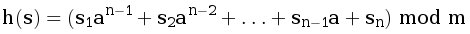

Алле очень понравился алгоритм вычисления полиномиального хеша. Помогите ей написать функцию, вычисляющую хеш строки s. В данной задаче необходимо использовать в качестве значений отдельных символов их коды в таблице ASCII.
Полиномиальный хеш считается по формуле:

Формат ввода
В первой строке дано число a (1 ≤ a ≤ 1000) –— основание, по которому считается хеш.
Во второй строке дано число m (1 ≤ m ≤ 10^9) –— модуль.
В третьей строке дана строка s (0 ≤ |s| ≤ 10^6), состоящая из больших и маленьких латинских букв.

Формат вывода
Выведите целое неотрицательное число –— хеш заданной строки.