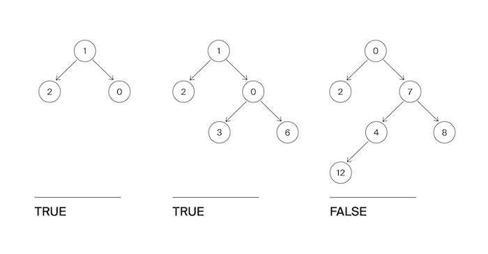

Гоше очень понравилось слушать рассказ Тимофея про деревья. Особенно часть про сбалансированные деревья. Он решил написать функцию, которая определяет, сбалансировано ли дерево.
Дерево считается сбалансированным, если левое и правое поддеревья каждой вершины отличаются по высоте не больше, чем на единицу.

Формат ввода
На вход функции подаётся корень бинарного дерева.
Замечания про отправку решений
По умолчанию выбран компилятор make. Решение нужно отправлять в виде файла с расширением, которое соответствует вашему языку программирования. Если вы пишете на Java, имя файла должно быть Solution.java, для C# – Solution.cs. Для остальных языков назовите файл my_solution.ext, заменив ext на необходимое расширение.

Формат вывода
Функция должна вернуть True, если дерево сбалансировано в соответствии с критерием из условия, иначе - False.
