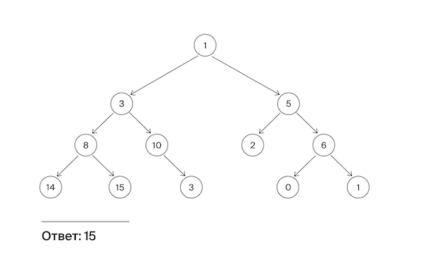

Гоша повесил на стену гирлянду в виде бинарного дерева, в узлах которого находятся лампочки. У каждой лампочки есть своя яркость. Уровень яркости лампочки соответствует числу, расположенному в узле дерева. Помогите Гоше найти самую яркую лампочку в гирлянде, то есть такую, у которой яркость наибольшая.

Формат ввода
На вход подается корень дерева.
Замечания про отправку решений
По умолчанию выбран компилятор make. Решение нужно отправлять в виде файла с расширением, которое соответствует вашему языку программирования. Если вы пишете на Java, имя файла должно быть Solution.java, для C# – Solution.cs. Для остальных языков назовите файл my_solution.ext, заменив ext на необходимое расширение.

Формат вывода
Функция должна вернуть максимальное значение яркости в узле дерева.