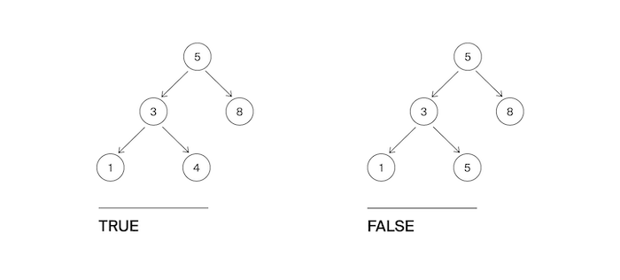

Гоша понял, что такое дерево поиска, и захотел написать функцию, которая определяет, является ли заданное дерево деревом поиска. Значения в левом поддереве должны быть строго меньше, в правом —- строго больше значения в узле.
Помогите Гоше с реализацией этого алгоритма.

Формат ввода
На вход функции подается корень бинарного дерева.
Замечания про отправку решений
По умолчанию выбран компилятор make. Решение нужно отправлять в виде файла с расширением, которое соответствует вашему языку программирования. Если вы пишете на Java, имя файла должно быть Solution.java, для C# – Solution.cs. Для остальных языков назовите файл my_solution.ext, заменив ext на необходимое расширение.

Формат вывода
Функция должна вернуть True, если дерево является деревом поиска, иначе - False.