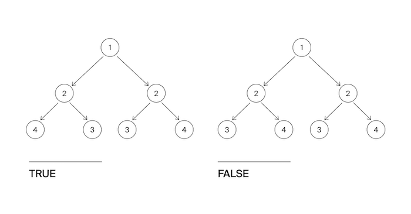

Гоша и Алла играют в игру «Удивительные деревья». Помогите ребятам определить, является ли дерево, которое им встретилось, деревом-анаграммой?
Дерево называется анаграммой, если оно симметрично относительно своего центра.

Формат ввода
Напишите функцию, которая определяет, является ли дерево анаграммой.
На вход подаётся корень дерева.
Замечания про отправку решений
По умолчанию выбран компилятор make. Решение нужно отправлять в виде файла с расширением, которое соответствует вашему языку программирования. Если вы пишете на Java, имя файла должно быть Solution.java, для C# – Solution.cs. Для остальных языков назовите файл my_solution.ext, заменив ext на необходимое расширение.

Формат вывода
Функция должна вернуть True если дерево является анаграммой. Иначе - False.