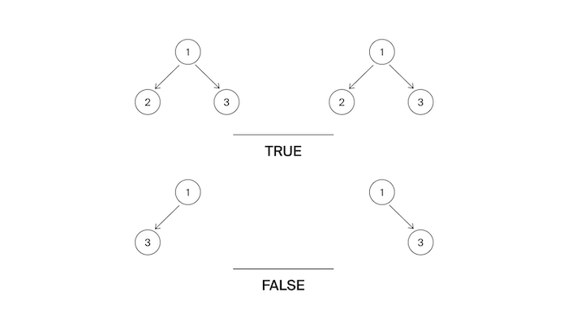

Гоше на день рождения подарили два дерева. Тимофей сказал, что они совершенно одинаковые. Но, по мнению Гоши, они отличаются.
Помогите разрешить этот философский спор!

Формат ввода
На вход подаются корни двух деревьев.
Замечания про отправку решений
По умолчанию выбран компилятор make. Решение нужно отправлять в виде файла с расширением, которое соответствует вашему языку программирования. Если вы пишете на Java, имя файла должно быть Solution.java, для C# – Solution.cs. Для остальных языков назовите файл my_solution.ext, заменив ext на необходимое расширение.

Формат вывода
Функция должна вернуть True если деревья являются близнецами. Иначе - False.